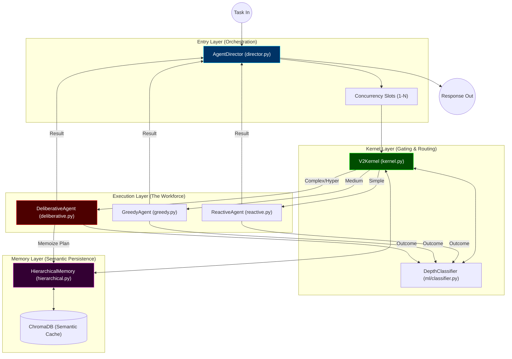

# SOMA V2: Universal Reasoning Kernel Architecture

This document maps the structural logic of SOMA V2. Click on the file names in the table below to navigate directly to the implementation.

## 1. Architectural Map (Mermaid)

## 2. Directory & Role Reference

| Component | File Path | "The Layman Metaphor" | Core Responsibility |
| :--- | :--- | :--- | :--- |
| **Orchestrator** | [director.py](file:///c:/Users/HP%20VICTUS/Documents/my_mcp/urban-swarm-os-v2/src/soma_v2/core/director.py) | The Receptionist | Manages concurrency slots, LLM callbacks, and task assignment. |
| **Gating Logic** | [kernel.py](file:///c:/Users/HP%20VICTUS/Documents/my_mcp/urban-swarm-os-v2/src/soma_v2/core/kernel.py) | The Triage Nurse | Routes tasks based on complexity. Consults memory before LLM. |
| **Semantic Memory** | [hierarchical.py](file:///c:/Users/HP%20VICTUS/Documents/my_mcp/urban-swarm-os-v2/src/soma_v2/memory/hierarchical.py) | The Library | Manages episodic memory and semantic plan caching via ChromaDB. |
| **Complex Agent** | [deliberative.py](file:///c:/Users/HP%20VICTUS/Documents/my_mcp/urban-swarm-os-v2/src/soma_v2/agents/deliberative.py) | The Architect | Generates 10-step plans and is the primary consumer of the Cache. |
| **Medium Agent** | [greedy.py](file:///c:/Users/HP%20VICTUS/Documents/my_mcp/urban-swarm-os-v2/src/soma_v2/agents/greedy.py) | The Technician | Executes 2-3 step tasks using immediate LLM heuristics. |
| **Fast Agent** | [reactive.py](file:///c:/Users/HP%20VICTUS/Documents/my_mcp/urban-swarm-os-v2/src/soma_v2/agents/reactive.py) | The Reflex | Instant execution of pre-programmed atomic actions. |
| **ML Gate** | [classifier.py](file:///c:/Users/HP%20VICTUS/Documents/my_mcp/urban-swarm-os-v2/src/soma_v2/ml/classifier.py) | The Student | Learns from every execution to improve future routing accuracy. |

## 3. Data Flow Summary

1.  **Ingestion**: `AgentDirector` receives a task and waits for an available slot.
2.  **Triage**: `V2Kernel` analyzes the task. It checks `HierarchicalMemory` first—if a similar plan exists, it "teleports" to execution.
3.  **Gating**: If no cache is found, the `DepthClassifier` predicts if the task is Simple, Medium, or Complex.
4.  **Execution**: The assigned agent (e.g., `DeliberativeAgent`) carries out the logic.
5.  **Learning**: Once the task is finished, the outcome is recorded in the `DepthClassifier` (online learning) and the plan is stored in `HierarchicalMemory` (plan memoization).
